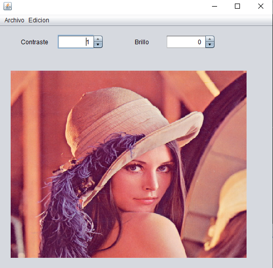

# OpenCv + Java
## Ejemplos de OpenCv & Java
https://github.com/luisreylara/OpenCv/blob/master/files/Opencv_1.java
* [Hola OpenCV 1](./files/Opencv_1.java)
* [Hola OpenCV 2](./files/Opencv_2.java)

* [Cargar imagen y menus. Proyecto completo](./files/OpenCV.zip)
* 
* [Cargar imagen spinner Proyecto completo](./files/OpenCv_Spinner.zip)
* 

* Reconocimiento Facial con Java y OpenCV
* https://www.youtube.com/watch?v=zrRnip9T_6c
* https://jonathanmelgoza.com/blog/ejemplo-de-identificacion-de-caras-en-java-con-opencv/
